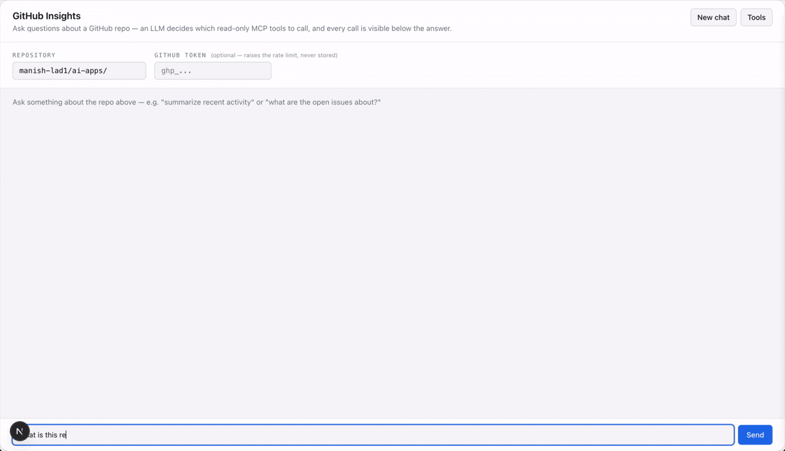

# GitHub Insights MCP

An MCP server that exposes **read-only GitHub repo insight tools**, plus a reference chat
UI that shows it working end-to-end with an LLM deciding which tools to call.

The project has two self-contained parts:

| Folder | What it is |
|---|---|
| [`mcp-server/`](./mcp-server) | **The primary artifact.** A standalone MCP server (stdio transport) exposing 13 read-only tools for a GitHub repo's structure, activity, issues, and PRs. Works in any MCP client — Claude Desktop, Claude Code, the MCP inspector — not just the demo UI. |
| [`demo-ui/`](./demo-ui) | A demo/reference Next.js chat app that spawns `mcp-server` as a subprocess, lets an LLM (Ollama or Claude) decide which tools to call to answer natural-language questions about a repo, and shows every tool call in a live **tool trace** panel. |

## Why two parts

The server is the real portfolio piece: a tool *provider*, not an agent, meant to be
useful standalone in any MCP client. The demo UI exists only to prove it works end-to-end
and to make the MCP mechanics (tool calls, arguments, raw results) visible instead of
hiding them behind a chat bubble — it has no logic of its own beyond spawning the server
and running a tool-calling loop.

## Demo



## Requirements

- Node.js 20+
- (Optional) A GitHub personal access token with `public_repo` read scope — [create one
  here](https://github.com/settings/tokens). Without it, the server runs fine but is
  capped at GitHub's unauthenticated rate limit (60 req/hr vs. 5,000 with a token).

## Quick start

```bash
# 1. Build the server
cd mcp-server
npm install
npm run build

# 2. Run the demo UI against it
cd ../demo-ui
npm install
cp .env.example .env.local   # fill in ANTHROPIC_API_KEY, or leave LLM_PROVIDER=ollama
                              # optionally set GITHUB_TOKEN to raise the rate limit
npm run dev
```

Open http://localhost:3000, enter a repo (e.g. `manish-lad1/ai-apps`), and ask a question
— or click "Tools" to browse the live tool list first.

To use the server standalone (e.g. from Claude Desktop) without the demo UI at all, see
[`mcp-server/README.md`](./mcp-server/README.md) for the config snippet.

## What the server can answer

**Content & structure** — `get_repo_structure`, `get_file_content`, `search_code`, `get_readme`

**Activity & insights** — `summarize_changelog`, `get_commit_activity`, `get_contributor_stats`, `get_release_notes_draft`

**Issues & PRs** — `list_issues`, `get_issue_details`, `list_pull_requests`, `get_pr_details`, `search_issues`

Every tool takes `owner` and `repo` — nothing is hardcoded to one repository — and returns
structured JSON, not prose. Full descriptions are in
[`mcp-server/README.md`](./mcp-server/README.md), or browse them live via the demo UI's
"Tools" drawer.

## Design principles

- **Read-only.** No tool creates, updates, or deletes anything on GitHub.
- **No token required to start.** `GITHUB_TOKEN` is optional; without it the server just
  runs at GitHub's lower unauthenticated rate limit (60 req/hr vs. 5,000).
- **Structured over prose.** Tools return data; summarizing it into natural language is
  the calling LLM's job.
- **Self-contained.** Each folder has its own `package.json` and is independently
  installable/runnable — no shared packages or cross-folder imports.

## More detail

- [`mcp-server/README.md`](./mcp-server/README.md) — full tool list, auth, standalone
  usage, Claude Desktop config.
- [`demo-ui/README.md`](./demo-ui/README.md) — stack, env vars, chat-loop internals,
  known gotchas (e.g. `search_code` needing a token, Ollama tool-calling support).
