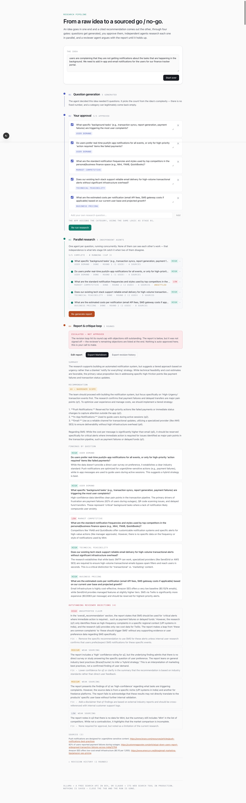

# Idea Research Pipeline

**From a raw idea to a sourced go / no-go** — a multi-stage pipeline that turns a half-formed product idea into research questions you approve, researches each one with independent agents running real web searches, then writes a cited recommendation that a reviewer agent argues with until it holds up.

> Part of [ai-apps](../../) — a collection of open, forkable AI apps by [Manish Lad](https://manishlad.substack.com).

## Demo

<!--
  TODO: record demo.gif and swap the comment below for:
  

  Worth capturing, in order:
    1. the approval gate — edit a question, add a custom one, watch it get categorised
    2. the live research grid — the concurrency cap holding, queued rows backfilling
    3. at least one visible critique round — "sent back with N objection(s)"
    4. the final report — a flagged contradiction, and ideally an escalated run
-->



## What it does

You paste in the kind of idea that shows up in a product review with no data behind it — *"support says people lose track of which integrations are still working; maybe we build a health dashboard?"* — and it runs four gates:

```
01  Question generation   →  the idea becomes 5-12 specific, searchable research questions
02  Your approval         →  you edit, delete, add, approve. Nothing runs until you do.
03  Parallel research     →  one independent agent per question, each searching the real web
04  Report + critique     →  a report agent writes it; a reviewer agent sends it back until it holds
```

Out the other end: a go / no-go / go-narrower verdict where every claim traces to a URL, every question carries a confidence that was *computed* rather than *asserted*, and anywhere the research contradicts itself is flagged rather than smoothed over.

### Why this is a *pipeline*, not a crew

This is the repo's first `_pipeline` project, so the distinction is worth being precise about — the three patterns get used interchangeably and they behave very differently.

| Pattern | Shape | Agents talk to each other? | In this repo |
|---|---|---|---|
| **Agent** | One model, one loop, possibly multi-step internally | n/a | [`prd_critique_agent`](../../ai_agents/prd_critique_agent) |
| **Crew** | Several agents cooperating or debating toward one answer | Yes — they negotiate | *(none yet)* |
| **Pipeline** | Stages hand artifacts forward; each stage's output is the next one's input | No — they hand off | **this project** |

Inside stage 03 the pipeline uses **decomposition**, which is the part most worth stealing. Six research agents run at once, and none can see any other's question, evidence, or conclusion. No shared scratchpad, no message passing.

That isolation is a feature, not a gap. If the agents could see each other, the one researching *"is this market crowded?"* and the one researching *"do users actually want this?"* would notice they were heading in opposite directions and quietly reconcile — averaging a real conflict into a comfortable middle before any human saw it. Keeping them independent means a contradiction *survives* to stage 04, where detecting it is somebody's explicit job. **A contradiction between two agents is a signal, and a crew would have negotiated it away.**

The one place agents genuinely interact is stage 04, and even there it's **asymmetric**: the critic reviews and objects, but never rewrites.

## Requirements

- **Node.js 20+** and npm
- One **LLM** provider: [Ollama](https://ollama.com) with a local model (free) **or** an [Anthropic](https://console.anthropic.com) API key
- One **search** provider: a free [Tavily](https://tavily.com) key **or** the Anthropic key above (Claude's built-in web search)

The two are chosen independently, so any combination works. The two most useful:

| | LLM | Search | Cost |
|---|---|---|---|
| **Local dev** | Ollama `gemma3:12b` | Tavily free tier | Free |
| **Production** | Claude `claude-opus-5` | Claude's `web_search` tool | API usage |

## Quick start

```bash
git clone https://github.com/manish-lad1/ai-apps.git
cd ai-apps/pipeline_apps/idea_research_pipeline
npm install
cp .env.example .env.local
```

Then pick a path.

### Path A — free local dev (Ollama + Tavily)

```bash
ollama pull gemma3:12b   # or another chat model
```

> **Model note:** prefer a model *without* a thinking/reasoning mode (e.g. `gemma3`, not `gemma4`). Reasoning-mode models leak internal thinking tokens into schema-constrained JSON and can spend their whole output budget on hidden reasoning. This project sets `think: false` on every Ollama call for exactly that reason — which makes `gemma4` work too — but a non-reasoning model avoids the failure mode entirely.

**Getting a Tavily key.** Sign up at [app.tavily.com](https://app.tavily.com) with an email and password — **no credit card**. The key appears on the dashboard immediately and starts with `tvly-`.

**Quota:** the free tier is a permanent **1,000 search credits per month**, and a basic search costs 1 credit. A run of 6 questions at 2 search rounds each costs about 12 credits — so roughly **80 full research runs a month, free**. If you exhaust it, the app surfaces the 429 as a clear error rather than silently returning nothing.

```env
# .env.local
LLM_PROVIDER=ollama
OLLAMA_MODEL=gemma3:12b

SEARCH_PROVIDER=tavily
TAVILY_API_KEY=tvly-your-key-here
```

```bash
npm run dev
```

Open [http://localhost:3000](http://localhost:3000).

> **Why Tavily over the alternatives?** Brave Search's free tier is larger on paper (2,000 queries/month) but requires a card on file to activate. SerpAPI's free tier is 100 searches/month, which a single research run can nearly exhaust. Tavily was the only one of the three with a quota big enough to actually use, no card, and single-header auth — and it returns extracted page text rather than just links, which is what the research agents need to reason over.

### Path B — production (Claude + Claude's web search)

One key covers both halves; there is no separate search account and no separate quota.

```env
# .env.local
LLM_PROVIDER=claude
ANTHROPIC_API_KEY=your-key-here
ANTHROPIC_MODEL=claude-opus-5

SEARCH_PROVIDER=anthropic
```

```bash
npm run dev
```

> **Cost note:** a full run is `1 + N + (2 × revision rounds)` model calls, where N is the number of approved questions — roughly 12-15 calls, plus one web search per research round. `claude-sonnet-5` is a cheaper drop-in via `ANTHROPIC_MODEL` and handles this pipeline well.

The two providers are independent, so mixing works: Ollama for generation with Claude's web search, or Claude with Tavily.

### Tuning the pipeline

| Env var | Default | What it does |
|---|---|---|
| `MAX_CONCURRENT_RESEARCH_AGENTS` | `5` | Research agents in flight at once; the rest queue and backfill |
| `MAX_RESEARCH_ROUNDS_PER_QUESTION` | `3` | Search rounds one agent may run before it must report |
| `MAX_REPORT_REVISION_ROUNDS` | `3` | Report→critique cycles before escalating to you |

## Features

- **A human gate that actually gates.** Stage 03 cannot fire until you approve at least 3 questions. Rewrite any question inline, delete the ones that miss the point, add your own — custom questions get categorised by the same logic that generated the rest. The minimum is enforced server-side, not just in the button's `disabled` attribute.
- **Genuinely parallel, genuinely independent research.** One agent per question, capped concurrency with queue backfill. No shared context between them, by design.
- **Multi-round search with a hard cap.** Each agent searches, judges whether what came back actually answers its question, and searches again against the specific gap if not — up to a configurable ceiling.
- **Derived confidence, not self-reported.** Confidence is a pure function of checkable signals: how many *independent domains* corroborate, whether any source contradicts, and whether the agent ever reached an answer. No model is ever asked "how confident are you?".
- **Contradiction detection across questions.** The report stage is the first thing to see all the research at once, and flagging genuine cross-question conflicts is an explicit part of its job — surfaced inline in the report, never smoothed into confident prose.
- **An asymmetric critique loop you can inspect.** Every round's draft *and* the critique it drew are kept and shown, not just the final version.
- **Escalation instead of silent auto-approval.** If the loop hits its cap without the reviewer signing off, you get the report *plus* the outstanding objections, clearly marked as not approved.
- **Evidence that can't be fabricated.** A cited URL that never appeared in a real search result for that question is dropped in code, not just discouraged in a prompt.
- **Provider-agnostic twice over.** Swap the LLM (Ollama ↔ Claude) and the search backend (Tavily ↔ Claude web search) independently, each with one env var. No app code branches on either choice.
- **Editable, exportable output.** Edit the final report in-app and download it as Markdown, with the revision history as a separate export.

## How it works

Everything funnels through two provider-agnostic entry points. Nothing else in the app branches on a provider:

```
lib/llm-provider.ts     → generateStructured({ systemPrompt, userPrompt, schema })   Ollama | Claude
lib/search-provider.ts  → search(query)                                              Tavily | Claude web search
```

The flow, and where the loops are:

```
                    ┌─────────────────────────────────────────────┐
   raw idea ──────▶ │ 01  question-generator                      │
                    │     idea → 5-12 {question, category}        │
                    └──────────────────┬──────────────────────────┘
                                       ▼
                    ┌─────────────────────────────────────────────┐
                    │ 02  HUMAN GATE  (no agent)                  │
                    │     edit · delete · add · approve           │
                    │     ✋ blocks until ≥ 3 approved             │
                    └──────────────────┬──────────────────────────┘
                                       ▼
      ┌────────────────────────────────────────────────────────────────┐
      │ 03  research-agent × N — concurrency-capped, NO shared state    │
      │                                                                │
      │   ┌─ per agent, up to MAX_RESEARCH_ROUNDS_PER_QUESTION ─────┐   │
      │   │   search(query) → assess: enough? ──no──▶ new query ──┐ │   │
      │   │         ▲                    │ yes                   │ │   │
      │   │         └────────────────────┼───────────────────────┘ │   │
      │   └──────────────────────────────┼─────────────────────────┘   │
      │                                  ▼                             │
      │      deriveConfidence(sources, reachedSufficiency)   ← in code  │
      └────────────────────────────────┬───────────────────────────────┘
                                       ▼
      ┌────────────────────────────────────────────────────────────────┐
      │ 04  report-generator  ⇄  report-critic        (ASYMMETRIC)      │
      │                                                                │
      │     generate ──▶ critique ──approved?──yes──▶ done              │
      │        ▲              │ no                                     │
      │        └─── revise ◀──┘     up to MAX_REPORT_REVISION_ROUNDS    │
      │                                                                │
      │     cap hit without approval ──▶ ESCALATE to the user           │
      │                                  (never auto-approve)           │
      └────────────────────────────────┬───────────────────────────────┘
                                       ▼
                       rendered report · edit in-app · export Markdown
```

```
lib/
  llm-provider.ts      the ONE function that talks to Ollama or Claude
  search-provider.ts   the ONE function that talks to Tavily or Claude's web search
  confidence.ts        deriveConfidence() — the rule, in code, not in a prompt
  schemas.ts           JSON Schemas for every model call (2 levels deep, max)
  prompts.ts           every system/user prompt; tune output quality here first
  types.ts             shared client/server wire types
  config.ts            every env-tunable limit, read in one place
  repetition-guard.ts  detects degenerate/repetitive model output
  route-helpers.ts     input validation, the server-side gate, NDJSON streaming
  export-markdown.ts   report → Markdown (also what the in-app editor edits)

agents/
  question-generator.ts  idea → questions; also categorises your custom ones
  research-agent.ts      the round-capped search loop + the concurrency scheduler
  report-generator.ts    writes and revises the report
  report-critic.ts       reviews against a flaw rubric; approves or objects

app/api/
  generate-questions/    stage 01 + custom-question categorisation
  run-research/          stage 03 — streams live per-question status as NDJSON
  generate-report/       stage 04 — streams the generator/critic loop round by round
app/page.tsx             orchestrates the four stages and the gate

components/
  Stage.tsx            the numbered pipeline node + connecting rail
  QuestionList.tsx     the approval gate UI
  ResearchGrid.tsx     the live status grid (one row per agent)
  ReportView.tsx       report, contradictions, revision history, export
  ConfidenceBadge.tsx  renders derived confidence + the rule that produced it
```

## Example prompts

These are deliberately vague and a bit self-contradictory — closer to what actually arrives than a clean brief.

> *"We keep hearing from support that people lose track of which of our integrations are actually still connected and working. I want some kind of health dashboard. Not sure if this is a real problem or just loud customers."*

> *"Everyone's adding AI meeting summaries. Should we? Our users already record calls, so we have the audio."*

> *"Let's let teams pay in their local currency. Finance thinks it'll help conversion in Europe."*

> *"A browser extension that summarises long GitHub pull requests for reviewers."*

**What to check while it runs:**

- **Stage 01** — did it scale the question count to the idea, and did it leave a category empty when that category genuinely didn't apply? A pure infrastructure idea should have little to say about pricing.
- **Stage 02** — rewrite a question and confirm the agents research *your* version. Uncheck down to 2 and watch the gate block.
- **Stage 03** — expand a row. The trace shows the real queries, the moment the agent judged its evidence too thin, and what it searched next. Check that a `high` confidence really does have 3+ *distinct domains* behind it, and that a row marked `unsettled` never scores above `low`.
- **Stage 04** — the interesting case is an idea where market evidence and demand evidence disagree. Does `open_contradictions` name it, or does the summary read smoothly *because* it papered over it? Then open the revision history and read what the critic actually objected to.

## Design principles

Three decisions here are real architecture rather than boilerplate.

### Decomposition beats a crew when you want to *detect* disagreement

The obvious way to build stage 03 is a crew: let the research agents share findings so they can build on each other. It produces a more coherent-sounding result and a strictly worse one.

Agents that can see each other's work will reconcile. The market agent finding a crowded, well-funded space and the demand agent finding almost no user interest would notice the tension and meet in the middle — and the single most decision-relevant fact about that idea would disappear before a human ever saw it, replaced by fluent, moderate prose.

So they're isolated: each agent knows one question and nothing else. The contradiction survives, and stage 04 has an explicit job of finding it. **The point of decomposition here isn't parallelism — it's that independent conclusions stay independent.** Parallelism is a side benefit.

### Confidence is derived — and had to be derived from more than agreement

Asking a model to rate its own confidence measures its prose fluency, not its evidence. So the model's only job is to report checkable facts about each source — the URL, the claim, and whether it supports or contradicts the emerging answer — and `lib/confidence.ts` applies a fixed rule over those facts. Same sources, same confidence, every time, auditable without re-running anything.

Two details are the actual content of the idea:

**Corroboration is counted per domain, not per URL.** Three pages from one site is one outlet repeating itself. Counting URLs is how a single press release becomes "high confidence".

**Agreement alone is not enough — the question also has to get answered.** The first version counted corroborating domains and nothing else. In testing it confidently returned `high` on a question whose own findings read *"the provided sources do not contain information regarding..."* — three reputable sources, all agreeing with each other, none of them addressing what was asked. Counting agreement answers "do these sources agree?", not "do these sources answer the question?". So whether the agent reached sufficiency (versus exhausting its rounds) is now a second deterministic input, and an unsettled question is capped at `low` no matter how much its sources agree.

### Escalate; never auto-approve at the cap

When the revision loop runs out of rounds with the critic still objecting, the tempting move is to return the last draft and let it look finished. That produces the worst possible artifact: a report the reviewer *rejected*, presented as though it passed.

So hitting the cap is a distinct, visible outcome. The report still renders — a rejected report is still useful — but it's marked not approved, the critic's outstanding objections are listed under it, and both survive into the Markdown export. A loop that always ends in approval isn't a review, it's a delay.

## Key concepts learned building this

- **Isolation is a design tool, not a limitation.** The instinct with multiple agents is to give them shared context. Deliberately withholding it is what made cross-question contradictions *detectable* — the most useful thing this produces came from agents knowing less, not more.
- **A deterministic rule is only as good as its inputs.** "Compute it in code instead of asking the model" is the right instinct and only half the work. The first confidence rule was fully deterministic, fully auditable, and still confidently wrong, because it derived from source agreement without checking whether the sources were on topic. Moving a judgement into code doesn't make it correct — it makes it *inspectable*, which is how the flaw got found.
- **A prompt is a request; a filter is a guarantee.** Research agents are told not to invent URLs. They're *also* passed through a check that drops any cited URL which never appeared in a real search result — because a fabricated source would inflate the derived confidence, the one number that's supposed to be immune to model behaviour.
- **Models will approve and object at the same time.** The local critic returned `approved: true` alongside four findings. Structured output guarantees shape, not internal consistency, so "any high or medium finding blocks approval" is enforced in `report-critic.ts` rather than left to the model to hold in mind.
- **"Thinking" tokens compete with your output budget — a third time.** Same failure this repo hit on [`prd_critique_agent`](../../ai_agents/prd_critique_agent) (Claude's adaptive thinking eating `max_tokens`) and [`knowledge_base_rag`](../../rag_apps/knowledge_base_rag) (a reasoning-mode Ollama model returning empty answers). Both fixes ship here: `think: false` on every Ollama call, thinking explicitly disabled on the schema-constrained Claude calls, and every budget set per-call rather than left to a default.
- **But disabling thinking has its own failure modes.** On Claude Opus 5, turning thinking off can make the model write a tool call out as visible text instead of invoking it — the call silently never runs. So thinking is off for the JSON-only calls (no tools attached, nothing to skip) and left on for the web-search call. The right answer wasn't global.
- **The generator/critic pattern generalises, and the asymmetry is load-bearing.** Same shape as [`prd_critique_agent`](../../ai_agents/prd_critique_agent), but with two agents rather than one model critiquing itself. The critic never rewrites — it objects. Give both sides authoring rights and they converge on a compromise instead of a review.
- **Show the tool calls.** The live research grid borrows its visual pattern from [`github_insights_mcp`](../../mcp_apps/github_insights_mcp)'s tool-trace panel, for the same reason: an agent that shows its real queries and its own "this is still too thin" moments is auditable. A spinner is not.

## Known constraints

Deliberate scope decisions, called out so they don't read as bugs:

- **Nothing persists.** No database, no saved runs. Close the tab and the research is gone. Stage 03's output travels back through the browser to reach stage 04 — which is why the server re-validates it and recomputes confidence rather than trusting the payload.
- **No Jira or other export integrations.** Markdown download only, by design for v1.
- **Dev-mode search is quota-limited.** Tavily's free tier is 1,000 credits/month; a 6-question run costs about 12. Exhausting it surfaces a clear error, not empty results.
- **The Claude web-search path returns no raw page text.** Claude's `web_search` returns page content encrypted for server-side use only, so on that path the evidence is Claude's own written read of the pages rather than extracted text. The URL list still comes from the real search-result blocks, so citations stay checkable.
- **Question count is capped at 12** regardless of what the generator returns, because stage 03's cost scales directly with it.
- **No critic on question generation.** The human approval gate already serves that function, and a critic there would only add latency in front of the person about to edit them anyway.

## What else you can do with this

- **Persist runs** — the pipeline already has clean artifact boundaries between stages; adding a store between them is mostly plumbing, and would let a run resume after a failed stage.
- **A cheaper model per stage** — question generation and categorisation are easy; only the report and critique need the strong model. Route them independently.
- **Human-in-the-loop at stage 04** — let the user add their own objection to the critique before the revision round runs.
- **Make contradiction detection its own agent** — right now it's part of the report agent's job. A dedicated pass over the research, before any prose is written, would likely catch more.
- **Swap the domain entirely** — nothing about the shape is product-research-specific. Question → approve → decompose → research → report → critique works just as well for a due-diligence memo, a literature review, or an incident investigation. Change `lib/prompts.ts` and `lib/schemas.ts`.

## More detail

- [`AGENTS.md`](./AGENTS.md) — architecture notes and known failure modes, for AI coding agents working on this project
- [`prd_critique_agent`](../../ai_agents/prd_critique_agent) — the generator/critic loop in single-agent form
- [`github_insights_mcp`](../../mcp_apps/github_insights_mcp) — the tool-trace UI pattern the research grid borrows
- [`NAMING.md`](../../NAMING.md) — why this is a `_pipeline` and not a `_crew`

## License

MIT — see the [root LICENSE](../../LICENSE).
