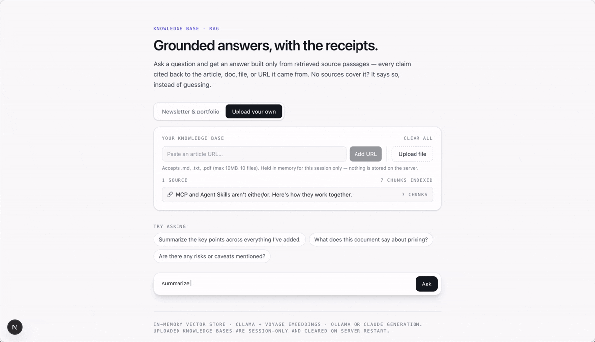

# Knowledge Base RAG

**Grounded answers, with the receipts** — a retrieval-augmented Q&A app that answers only from retrieved source passages and cites every claim back to the article, doc, file, or URL it came from. Ask a built-in corpus (the *AI from the Inside* newsletter + this repo's docs), or upload your own files and URLs.

> Part of [ai-apps](../../) — a collection of open, forkable AI apps by [Manish Lad](https://manishlad.substack.com).

## Demo



## What it does

Most "chat with your docs" demos will happily answer from the model's general knowledge the moment retrieval comes up short — which is exactly when a confident, ungrounded answer does the most damage. This app is built the other way around: it retrieves first, answers only from what it retrieved, cites each passage inline, and says *"the sources don't cover that"* when nothing relevant is found, instead of guessing.

It has two modes that share one pipeline (chunk → embed → retrieve → generate) and differ only in where the corpus comes from:

1. **Newsletter & portfolio (built-in)** — pre-indexed with the newsletter archive and every README in this repo. Ask *"what has this author written about evals?"* and get an answer grounded in the actual article, cited back to the section it came from.
2. **Upload your own (session)** — drop in `.md` / `.txt` / `.pdf` files or paste article URLs, and the app builds an **ephemeral, session-scoped** knowledge base to answer against. Nothing persists: no database, no server-side storage keyed to you. Close the tab or restart the server and it's gone — by design.

## Requirements

- **Node.js 20+** and npm
- One **embedding** provider: [Ollama](https://ollama.com) with `nomic-embed-text` (free, local) **or** a [Voyage AI](https://voyageai.com) API key (production)
- One **generation** provider: Ollama with a chat model (free, local) **or** an [Anthropic](https://console.anthropic.com) API key (production)

Embeddings and generation are chosen independently, so any combination works. The two most useful:

| | Embeddings | Generation | Cost |
|---|---|---|---|
| **Local dev** | Ollama `nomic-embed-text` | Ollama `gemma4:12b` | Free |
| **Production** | Voyage `voyage-3` | Claude `claude-sonnet-5` | API usage |

## Quick start

```bash
git clone https://github.com/manish-lad1/ai-apps.git
cd ai-apps/rag_apps/knowledge_base_rag
npm install
cp .env.example .env.local
```

Then pick a path.

### Path A — fully local & free (Ollama + Ollama)

```bash
ollama pull nomic-embed-text   # embeddings
ollama pull gemma4:12b         # generation (any chat model works)
```
> **Model note:** prefer models *without* a "thinking"/reasoning mode for local use (e.g. `gemma3`, not `gemma4`). Reasoning-mode models can leak internal thinking tokens into schema-constrained JSON, corrupting the output — see [Key concepts](#key-concepts-learned-building-this) below. The degeneration guard catches this, but a non-reasoning model avoids it entirely.

```env
# .env.local
LLM_PROVIDER=ollama
OLLAMA_MODEL=gemma4:12b
EMBEDDING_PROVIDER=ollama
OLLAMA_EMBEDDING_MODEL=nomic-embed-text
```

Build the built-in corpus, then run:

```bash
npm run ingest    # embeds the newsletter + repo docs → data/embeddings.json
npm run dev
```

Open [http://localhost:3000](http://localhost:3000).

### Path B — production (Voyage embeddings + Claude generation)

```env
# .env.local
LLM_PROVIDER=anthropic
ANTHROPIC_API_KEY=your-key-here
ANTHROPIC_MODEL=claude-sonnet-5
EMBEDDING_PROVIDER=voyage
VOYAGE_API_KEY=your-key-here
VOYAGE_MODEL=voyage-3
```

> The built-in corpus must be embedded with the **same** provider you'll query it with — Voyage and Ollama vectors aren't comparable. Re-run `npm run ingest` after switching `EMBEDDING_PROVIDER`. The app detects a mismatch and tells you rather than returning garbage scores.

```bash
npm run ingest    # now embeds with Voyage
npm run dev
```

> **Voyage is Anthropic's recommended embedding provider for RAG on Claude.** The free tier covers prototyping and light production use. You can also mix paths (e.g. Ollama embeddings + Claude generation) — the two providers are fully independent.

## Features

- **Grounded-or-silent answers** — retrieval runs first; if nothing clears a similarity threshold the app refuses to answer rather than fabricating. The generation prompt reinforces this: answer only from the provided passages, or say they don't cover it.
- **Inline citations with the actual snippet** — every answer carries a numbered source list ([1], [2]…) mapping to the passages used. Expand any citation to read the exact retrieved text, its section heading, and its match score.
- **Two modes, one pipeline** — built-in corpus and bring-your-own share identical chunking, embedding, retrieval, and generation. Only the vector store differs.
- **Provider-agnostic, twice over** — swap the embedding provider (Ollama ↔ Voyage) and the generation provider (Ollama ↔ Claude) independently, each with a single env var. No app code branches on the choice.
- **`input_type`-aware embeddings** — corpus content is embedded as documents and questions as queries, a one-line distinction both Voyage and `nomic-embed-text` reward with better retrieval.
- **Real SSRF protection on URL ingestion** — private/reserved IPs and non-HTTP schemes are blocked, and every redirect hop is re-validated (see [Design principles](#design-principles)).
- **Heading-aware chunking** — documents split on Markdown headings first, so a citation can say *which section* an answer came from, not just which file.
- **No database, no vector DB** — a plain in-memory cosine-similarity store, appropriate at this scale and dependency-free.

## How it works

The pipeline is the same in both modes; only the vector store the query hits is different.

```
Ingest (once, for built-in)         Per request (session mode)
────────────────────────────        ───────────────────────────
content/ + repo READMEs             uploaded file / pasted URL
   │  chunkDocument()                  │  extract → chunkDocument()
   │  embed(…, "document")             │  embed(…, "document")
   ▼                                   ▼
data/embeddings.json  ──load──▶  in-memory VectorStore  ◀──  Map<sessionId, store>

Query (both modes)
──────────────────
question ─ embed(…, "query") ─ store.search(topK, minScore)
   │
   ├─ no hits above threshold ──▶ "the sources don't cover that" (no model call)
   └─ hits ──▶ buildRagPrompt(passages) ──▶ generateText() ──▶ answer + citations
```

```
lib/
  llm-provider.ts        the ONE function that talks to Ollama or Claude (generation)
  embedding-provider.ts  the ONE function that talks to Ollama or Voyage (embeddings),
                          input_type-aware
  chunking.ts            heading-aware Markdown/text chunker + token estimate
  vector-store.ts        in-memory cosine store: add() / search(topK, minScore) / clear()
  url-fetcher.ts         fetch + Readability extraction + SSRF guard (per-hop)
  pdf-extractor.ts       PDF text extraction (pdf-parse), isolated behind one function
  session-store.ts       Map<sessionId, VectorStore> with a TTL cleanup sweep
  corpus-store.ts        loads data/embeddings.json once; guards provider mismatch
  prompts.ts             retrieval constants (TOP_K, MIN_SCORE) + the grounded prompt
  route-helpers.ts       session ingestion + upload limits
  types.ts               shared client/server wire types

app/api/
  chat/route.ts          embed query → retrieve → grounded generate → answer + citations
  upload/route.ts        file upload → extract → chunk → embed → session store
  ingest-url/route.ts    URL → SSRF-guarded fetch → extract → chunk → embed → session store
  clear/route.ts         drop a session's knowledge base
  corpus/route.ts        built-in corpus status/stats for the UI
app/page.tsx             mode toggle, source panel, chat, expandable citations

scripts/ingest.ts        rerunnable: reads content/ + repo READMEs → data/embeddings.json
content/newsletter/*.md  built-in corpus source (frontmatter: title/date/url)
```

## Example prompts

**Built-in mode:**

> *"What has this author written about evals?"*

> *"What's the difference between golden-output and flaw-based evals?"*

> *"What projects are in this repo and what does each one do?"*

> *"How does the PRD critique agent avoid trusting the model's arithmetic?"*

Then ask something the corpus *doesn't* cover — *"what's a good sourdough recipe?"* — to watch it decline instead of inventing an answer.

**Upload mode:** add a PDF report or paste a news article, then ask for a summary, a specific figure, or the risks it mentions — and check the citation snippet to confirm the answer actually came from your source.

## Design principles

Two decisions in here are genuine architecture, not boilerplate — worth explaining.

### The SSRF guard is a security control, not a formality

`/api/ingest-url` fetches an arbitrary user-supplied URL **from the server**, which sits inside a network the user can't otherwise reach. Unguarded, that's a textbook Server-Side Request Forgery hole: a user could point it at `http://169.254.169.254` (the cloud metadata endpoint that hands out IAM credentials), at `http://localhost:<port>` to probe internal services, or at any private address to map the internal network.

So before any fetch, `lib/url-fetcher.ts` resolves the hostname and rejects private/reserved ranges (`127.0.0.0/8`, `10/8`, `172.16/12`, `192.168/16`, `169.254/16`, `::1`, `fc00::/7`, link-local, and more) and refuses non-HTTP(S) schemes. Crucially, it follows redirects **manually and re-checks every hop** — a public URL that `302`s to an internal one is a classic bypass, so validating only the first URL isn't enough. If you point it at `localhost`, that's the guard working, not a bug.

### `input_type` is a free retrieval win

Both Voyage and `nomic-embed-text` can embed a *document* and a *search query* into deliberately different regions of the vector space when you tell them which is which. It's a one-line parameter — `input_type: "document"` when indexing, `input_type: "query"` when embedding the user's question (for Ollama, the equivalent `search_document:` / `search_query:` prefixes) — and it measurably improves retrieval. Skipping it is leaving quality on the table for no saving, so `embed()` always requires it.

## Key concepts learned building this

- **Retrieval quality is a chunking problem before it's a model problem.** Splitting on heading boundaries — so each chunk is one coherent idea with its section name attached — did more for answer quality (and citation specificity) than any prompt tweak.
- **A similarity threshold isn't a hallucination guard by itself.** Embedding models have a high similarity floor — even unrelated text often scores above a naive cutoff — so the *prompt* ("answer only from these passages, or say they don't cover it") ends up being the stronger guardrail. Use both: the threshold to skip empty retrievals, the prompt to refuse weak ones.
- **"Thinking" tokens compete with your answer budget — again.** A reasoning-capable local model (gemma4) spent its entire output budget on hidden reasoning and returned an **empty** answer on longer retrieved contexts. Setting `think: false` for the Ollama path fixed it — the same thinking-vs-output-budget failure the sibling PRD project hit on Claude's adaptive thinking.
- **Vectors are provider-locked.** A store embedded with Ollama can't be queried with Voyage — the numbers are meaningless across models. The built-in corpus records which provider produced it and the app refuses a mismatch loudly, because the alternative is silently wrong search results.
- **Ephemeral-by-design is a feature you have to document.** An in-memory session store *looks* like a persistence bug the first time uploads vanish on restart. Saying "this is deliberate" out loud (here and in the UI) is part of the design, not an apology for it.

## Known constraints

These are deliberate scope decisions, called out so they're not mistaken for bugs:

- **Session knowledge bases are in-memory only.** A server restart or redeploy clears every uploaded file and URL. There's no database and no disk persistence — see the last bullet above.
- **Built-in mode depends on `data/embeddings.json`.** If it's missing or was built with a different embedding provider, built-in mode says so clearly (run `npm run ingest`) rather than failing opaquely.
- **The SSRF guard blocks internal targets on purpose.** Pointing URL ingestion at `localhost` or a private IP returns a security error by design.

## What else you can do with this

- **Streaming answers** — swap the single request/response for token streaming from both providers.
- **Hybrid retrieval** — add BM25/keyword scoring alongside cosine similarity and fuse the rankings, which tends to beat pure vector search on exact-term queries.
- **Reranking** — run a cross-encoder (e.g. Voyage's reranker) over the top-K before generation for a precision bump.
- **Persistence** — graduate the session store to SQLite + `sqlite-vec`, or a real vector DB, if durability across restarts becomes a requirement.
- **More corpus sources** — the ingest script is just "read text → chunk → embed"; point it at more folders, an RSS feed, or exported docs.

## License

MIT — see the [root LICENSE](../../LICENSE).
